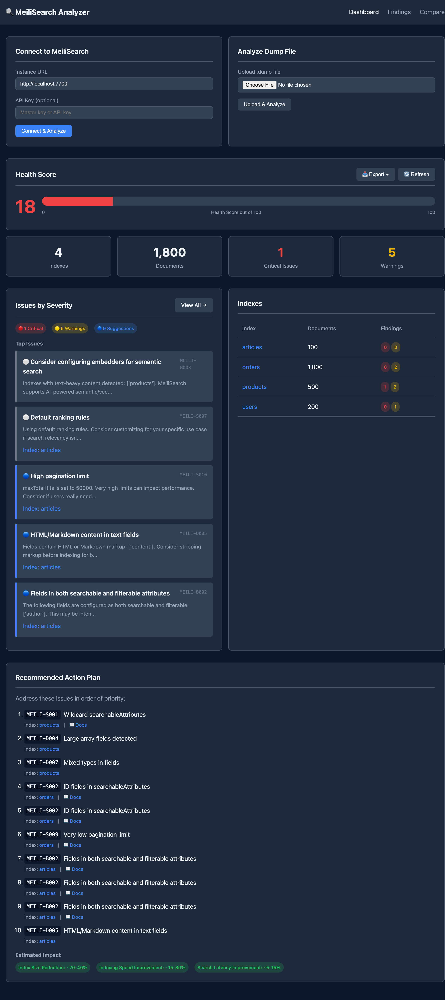
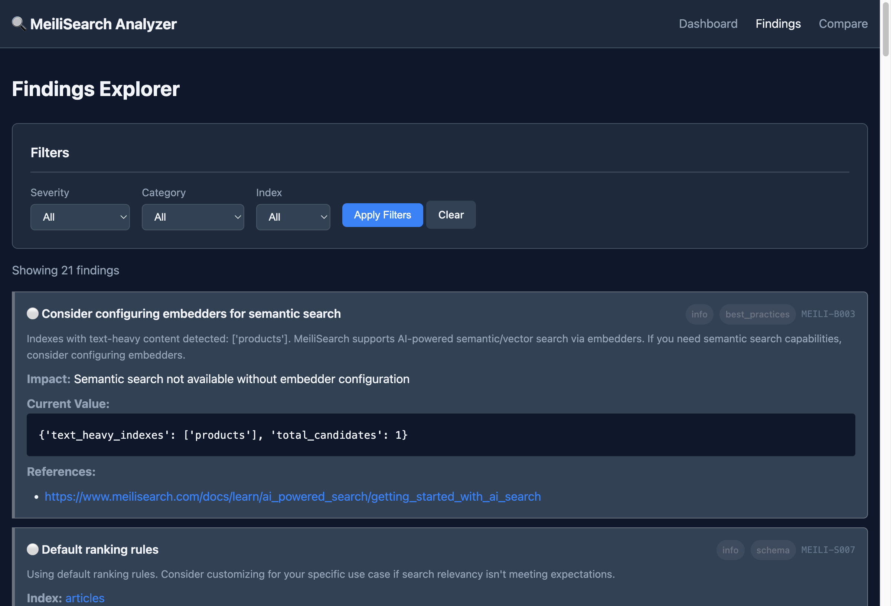
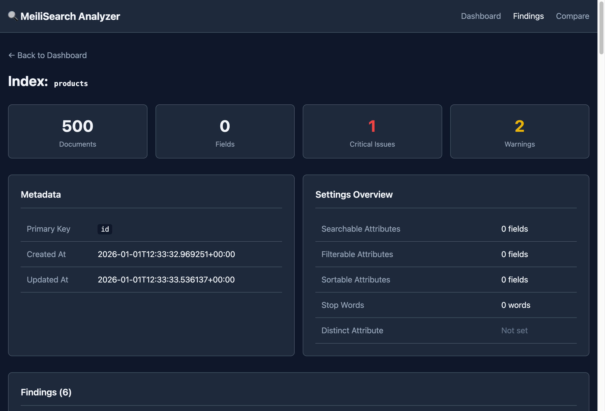

# MeiliSearch Analyzer

A comprehensive tool for analyzing MeiliSearch instances and dump files to identify optimization opportunities, potential pitfalls, and provide actionable recommendations.



## Features

- **Live Instance Analysis**: Connect to a running MeiliSearch instance and analyze its configuration
- **Dump File Analysis**: Parse and analyze MeiliSearch dump archives without a running instance
- **28 Finding Types**: Comprehensive checks across schema, documents, performance, and best practices
- **Health Scoring**: Get an overall health score for your MeiliSearch setup
- **Web Dashboard**: Interactive web UI for exploring analysis results
- **Historical Comparison**: Compare two analysis reports to track changes over time
- **Multiple Export Formats**: JSON, Markdown, SARIF (for GitHub/IDEs), and Agent-friendly output
- **CI/CD Integration**: Exit codes and flags for automated pipelines
- **Fix Script Generation**: Generate executable scripts to apply recommended fixes

## Requirements

- Python 3.11+
- [uv](https://docs.astral.sh/uv/) (recommended) or pip

## Installation

### From source (recommended for now)

```bash
git clone https://github.com/yourusername/meilisearch-analyzer.git
cd meilisearch-analyzer
make install-dev  # or: uv sync --all-extras
```

### Using pip (when published)

```bash
pip install meilisearch-analyzer
```

### Using uvx (when published)

```bash
uvx meilisearch-analyzer --help
```

## Quick Start

### Analyze a Live Instance

```bash
# Basic analysis
meilisearch-analyzer analyze --url http://localhost:7700

# With API key
meilisearch-analyzer analyze --url http://localhost:7700 --api-key your-master-key

# Save results to file
meilisearch-analyzer analyze --url http://localhost:7700 --output analysis.json
```

### Analyze a Dump File

```bash
# Analyze a dump archive
meilisearch-analyzer analyze --dump ./path/to/dump.dump

# Export as markdown
meilisearch-analyzer analyze --dump ./dump.dump --format markdown --output report.md
```

### Web Dashboard

```bash
# Start the web dashboard
meilisearch-analyzer serve --url http://localhost:7700 --port 8080

# Then open http://localhost:8080 in your browser
```

### Quick Health Summary

```bash
meilisearch-analyzer summary --url http://localhost:7700
```

## Example Output

### CLI Summary

```
$ meilisearch-analyzer summary --url http://localhost:7700

╭──────────────────────── MeiliSearch Analysis Summary ────────────────────────╮
│ Version: 1.16.0    Indexes: 4    Documents: 1,800                            │
│                                                                              │
│ Health Score: 18/100 (Critical)                                              │
│ ███░░░░░░░░░░░░░░░░░                                                         │
│                                                                              │
│ ● Critical: 1    ● Warnings: 5    ● Suggestions: 9    ● Info: 6              │
╰──────────────────────────────────────────────────────────────────────────────╯

Critical Issues:
  • products: Wildcard searchableAttributes

Run 'analyze' for full report
```

### CLI Analysis

```
$ meilisearch-analyzer analyze --url http://localhost:7700

╭──────────────────────── MeiliSearch Analysis Summary ────────────────────────╮
│ Version: 1.16.0    Indexes: 4    Documents: 1,800                            │
│                                                                              │
│ Health Score: 18/100 (Critical)                                              │
│ ███░░░░░░░░░░░░░░░░░                                                         │
│                                                                              │
│ ● Critical: 1    ● Warnings: 5    ● Suggestions: 9    ● Info: 6              │
╰──────────────────────────────────────────────────────────────────────────────╯
                                                                                
                                  Top Findings                                  
┏━━━━━━━━━━━━┳━━━━━━━━━┳━━━━━━━━━━━━━━━┳━━━━━━━━━━━━━━━━━━━━━━━━━━━━━━━━━━━━━━━┓
┃ ID         ┃ Severi… ┃ Index         ┃ Title                                 ┃
┡━━━━━━━━━━━━╇━━━━━━━━━╇━━━━━━━━━━━━━━━╇━━━━━━━━━━━━━━━━━━━━━━━━━━━━━━━━━━━━━━━┩
│ MEILI-S001 │ critic… │ products      │ Wildcard searchableAttributes         │
│ MEILI-S002 │ warning │ orders        │ ID fields in searchableAttributes     │
│ MEILI-S009 │ warning │ orders        │ Very low pagination limit             │
│ MEILI-D004 │ warning │ products      │ Large array fields detected           │
│ MEILI-D007 │ warning │ products      │ Mixed types in fields                 │
│ MEILI-S002 │ warning │ users         │ ID fields in searchableAttributes     │
│ MEILI-S010 │ sugges… │ articles      │ High pagination limit                 │
│ MEILI-D005 │ sugges… │ articles      │ HTML/Markdown content in text fields  │
│ MEILI-B002 │ sugges… │ articles      │ Fields in both searchable and         │
│            │         │               │ filterable attributes                 │
│ MEILI-S006 │ sugges… │ orders        │ No stop words configured              │
└────────────┴─────────┴───────────────┴───────────────────────────────────────┘

Use --output to save the full report to a file.
```

## Analysis Checks

### Schema Findings (S001-S010)

| ID | Title | Severity | Description |
|----|-------|----------|-------------|
| MEILI-S001 | Wildcard searchableAttributes | Critical | All fields are searchable, including IDs and numbers |
| MEILI-S002 | ID fields in searchableAttributes | Warning | ID fields shouldn't typically be searchable |
| MEILI-S003 | Numeric fields in searchableAttributes | Suggestion | Numeric fields may be better as filterable |
| MEILI-S004 | Empty filterableAttributes | Info | No filterable attributes configured |
| MEILI-S005 | Wildcard displayedAttributes with many fields | Suggestion | Large response payloads |
| MEILI-S006 | No stop words configured | Suggestion | Missing language-appropriate stop words |
| MEILI-S007 | Default ranking rules | Info | Using default ranking rules |
| MEILI-S008 | No distinct attribute set | Suggestion | Potentially duplicate results |
| MEILI-S009 | Very low pagination limit | Warning | maxTotalHits < 100 |
| MEILI-S010 | High pagination limit | Suggestion | maxTotalHits > 10000 |

### Document Findings (D001-D008)

| ID | Title | Severity | Description |
|----|-------|----------|-------------|
| MEILI-D001 | Large documents | Warning | Documents exceed recommended size |
| MEILI-D002 | Inconsistent schema | Warning | Field presence varies across documents |
| MEILI-D003 | Deep nesting | Warning | Deeply nested object structures |
| MEILI-D004 | Large arrays | Warning | Arrays with many elements |
| MEILI-D005 | HTML in text fields | Suggestion | Raw HTML in searchable content |
| MEILI-D006 | Empty field values | Info | Fields with empty or null values |
| MEILI-D007 | Mixed types in field | Warning | Same field has different types |
| MEILI-D008 | Very long text | Suggestion | Text fields exceeding optimal length |

### Performance Findings (P001-P006)

| ID | Title | Severity | Description |
|----|-------|----------|-------------|
| MEILI-P001 | High task failure rate | Critical | Many indexing tasks are failing |
| MEILI-P002 | Slow indexing | Warning | Indexing performance is degraded |
| MEILI-P003 | Database fragmentation | Suggestion | Database may benefit from optimization |
| MEILI-P004 | Too many indexes | Suggestion | Large number of indexes may impact performance |
| MEILI-P005 | Imbalanced indexes | Info | Document counts vary significantly |
| MEILI-P006 | Too many fields | Warning | Indexes have excessive field counts |

### Best Practices Findings (B001-B004)

| ID | Title | Severity | Description |
|----|-------|----------|-------------|
| MEILI-B001 | Settings after documents | Warning | Settings were updated after adding documents |
| MEILI-B002 | Duplicate searchable/filterable | Suggestion | Same fields in both searchable and filterable |
| MEILI-B003 | Missing embedders config | Info | No AI/vector search configuration |
| MEILI-B004 | Old MeiliSearch version | Suggestion/Warning | Running an outdated version |

## CLI Reference

### `analyze`

Analyze a MeiliSearch instance or dump file.

```bash
meilisearch-analyzer analyze [OPTIONS]
```

Options:
- `--url, -u`: MeiliSearch instance URL
- `--api-key, -k`: MeiliSearch API key (or set `MEILI_MASTER_KEY` env var)
- `--dump, -d`: Path to a MeiliSearch dump file
- `--output, -o`: Output file path
- `--format, -f`: Output format: `json`, `markdown`, `sarif`, `agent` (default: json)
- `--ci`: CI mode - exit with non-zero code on findings
- `--fail-on-warnings`: In CI mode, also fail on warnings (not just critical)

### `compare`

Compare two analysis reports to track changes over time.

```bash
meilisearch-analyzer compare OLD_REPORT NEW_REPORT [OPTIONS]
```

Options:
- `--output, -o`: Output file path
- `--format, -f`: Output format: `json`, `markdown` (default: markdown)

### `fix-script`

Generate a shell script to apply recommended fixes.

```bash
meilisearch-analyzer fix-script --input REPORT_JSON --output SCRIPT_PATH
```

Options:
- `--input, -i`: Path to analysis JSON report
- `--output, -o`: Output script path

### `serve`

Start the web dashboard.

```bash
meilisearch-analyzer serve [OPTIONS]
```

Options:
- `--url, -u`: MeiliSearch instance URL
- `--api-key, -k`: MeiliSearch API key
- `--host`: Dashboard host (default: 127.0.0.1)
- `--port, -p`: Dashboard port (default: 8080)

### `summary`

Display a quick health summary.

```bash
meilisearch-analyzer summary [OPTIONS]
```

Options:
- `--url, -u`: MeiliSearch instance URL (required)
- `--api-key, -k`: MeiliSearch API key

## Export Formats

### JSON (default)

Structured JSON output for programmatic processing.

```bash
meilisearch-analyzer analyze --url ... --format json --output report.json
```

### Markdown

Human-readable report with tables and formatted findings.

```bash
meilisearch-analyzer analyze --url ... --format markdown --output report.md
```

### SARIF

Static Analysis Results Interchange Format for GitHub Code Scanning and IDE integration.

```bash
meilisearch-analyzer analyze --url ... --format sarif --output results.sarif
```

### Agent

Optimized output for AI coding agents (Claude, GPT, etc.) with prioritized issues and fix commands.

```bash
meilisearch-analyzer analyze --url ... --format agent --output agent-context.md
```

## CI/CD Integration

Use the `--ci` flag to enable CI mode with appropriate exit codes:

```bash
# Exit code 2 on critical findings, 0 otherwise
meilisearch-analyzer analyze --url http://localhost:7700 --ci

# Exit code 1 on warnings, 2 on critical findings
meilisearch-analyzer analyze --url http://localhost:7700 --ci --fail-on-warnings
```

### GitHub Actions Example

```yaml
- name: Analyze MeiliSearch
  run: |
    meilisearch-analyzer analyze \
      --url ${{ secrets.MEILISEARCH_URL }} \
      --api-key ${{ secrets.MEILISEARCH_API_KEY }} \
      --format sarif \
      --output results.sarif \
      --ci

- name: Upload SARIF
  uses: github/codeql-action/upload-sarif@v2
  with:
    sarif_file: results.sarif
```

## Web Dashboard

The web dashboard provides an interactive interface for exploring analysis results:

- **Dashboard Overview**: Health score gauge, summary statistics, quick actions
- **Index Details**: Per-index settings, statistics, and findings
- **Findings Explorer**: Filter by severity, category, and index
- **Comparison View**: Upload and compare two JSON reports
- **Document Sampling**: Preview sample documents from each index

Start the dashboard:

```bash
meilisearch-analyzer serve --url http://localhost:7700 --port 8080
```

### Findings Explorer

Filter and explore all findings by severity, category, or index:



### Index Details

Drill down into individual indexes to see settings, statistics, and findings:



## Development

### Setup

```bash
git clone https://github.com/yourusername/meilisearch-analyzer.git
cd meilisearch-analyzer
make install-dev  # or: uv sync --all-extras
```

### Makefile Commands

Run `make help` for a full list of commands.

```bash
# Setup
make install-dev     # Install all dependencies

# Testing
make test            # Run all tests
make test-cov        # Run tests with coverage report
make test-file F=tests/test_schema_analyzer.py  # Run single test file

# Code Quality
make lint            # Run ruff linter
make format          # Format code with ruff

# Development
make serve           # Start web dashboard on http://localhost:8080
make serve-dev       # Start with auto-reload

# Test Data Seeding
make seed-dump       # Create test-dump.dump with sample data
make seed-instance   # Seed MeiliSearch at localhost:7700
make seed-instance MEILI_URL=http://localhost:7700 MEILI_API_KEY=my-key
make seed-clean      # Delete all test indexes

# Cleanup
make clean           # Remove build artifacts and cache
```

### Running Tests

```bash
# All tests
make test

# With coverage
make test-cov

# Single test file
make test-file F=tests/test_schema_analyzer.py

# Single test function
uv run pytest tests/test_schema_analyzer.py::TestSchemaAnalyzer::test_wildcard -v

# Pattern matching
uv run pytest -k "test_large"
```

### Project Structure

```
meilisearch_analyzer/
├── analyzers/       # Analysis logic (schema, document, performance, best_practices)
├── collectors/      # Data collection (live_instance.py, dump_parser.py)
├── core/            # Orchestration (collector.py, reporter.py, scorer.py)
├── exporters/       # Output formats (json, markdown, sarif, agent)
├── models/          # Pydantic models (finding.py, index.py, report.py)
├── web/             # FastAPI dashboard + templates + static/
└── cli.py           # Typer CLI entry point
```

## License

MIT

## Contributing

Contributions are welcome! Please feel free to submit a Pull Request.
